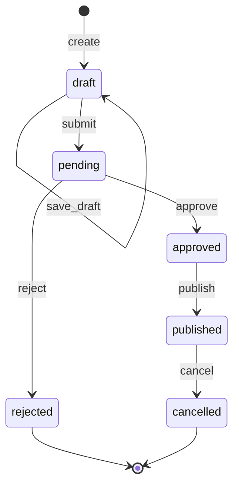

# Attendance Operations Alpha

Status: development baseline
Date: 2026-08-10
Scope: one cast member, one service date and one owner-authorized operator

## Goal and boundary

The first durable operations slice lets an authorized owner create one attendance
entry, submit it, approve or reject it, publish it to the public profile, and
cancel a published entry. Public pages read only published entries.

This alpha does not include customer accounts, booking, payments, staff payroll,
recurring shifts, bulk editing, or automatic publication.

## Facts, assumptions and unknowns

### Confirmed facts

- The public site stays anonymous.
- `/admin` uses Sign in with ChatGPT and a server-side user ID allowlist.
- Attendance data is isolated from the existing profile and media probe.
- Every state-changing command requires an idempotency key and an expected
  version after creation.
- Every command writes an append-only event record.
- Cancelling a published entry removes it from the public projection.

### Alpha assumptions

- One owner identity may perform submit, review and publish actions during this
  slice because real staff identities and shift responsibilities are not yet
  available.
- One active attendance entry per cast member and service date is sufficient.
- Times are stored as Tokyo local `HH:MM` values and must satisfy
  `start_time < end_time`.

### Reality checks still required

- Which real staff role creates, reviews, publishes and cancels attendance.
- Whether self-approval is acceptable after more staff accounts exist.
- Cut-off times for same-day changes.
- Whether overnight shifts may cross midnight.
- Required cancellation reasons and public wording.

## Ubiquitous language

| Term | Meaning |
|---|---|
| Attendance entry | One cast member's proposed service window for one date |
| Active date | A cast member and date combination whose status is not rejected or cancelled |
| Command | An authenticated intent to create or change an attendance entry |
| Event | An append-only fact that a command completed |
| Public projection | The fields visible to anonymous visitors |
| Expected version | The entry version the operator last read |
| Idempotency key | A unique command key that makes retries safe |

## Aggregate and invariants

`AttendanceEntry` is the aggregate root.

Required invariants:

1. `artist_slug` must identify an existing local cast profile.
2. `service_date` uses `YYYY-MM-DD`.
3. `start_time` and `end_time` use `HH:MM`.
4. `start_time < end_time`.
5. Only one active entry may exist for the same cast member and service date.
6. A command after creation must match the current `version`.
7. Every completed command records one event with a unique idempotency key and
   the exact aggregate snapshot returned by that command.
8. Anonymous queries expose only `published` entries and public fields.
9. A `cancelled` entry leaves the public projection immediately.

## State contract

| Command | Current status | Result | Required data |
|---|---|---|---|
| `create` | none | `draft` | cast, date, start, end |
| `save_draft` | `draft` | `draft` | expected version and valid schedule |
| `submit` | `draft` | `pending` | expected version |
| `approve` | `pending` | `approved` | expected version |
| `reject` | `pending` | `rejected` | expected version and reason |
| `publish` | `approved` | `published` | expected version |
| `cancel` | `published` | `cancelled` | expected version and reason |

Any other transition returns a deterministic conflict and leaves both the entry
and event log unchanged.

## Commands and events

| Command | Event |
|---|---|
| `create` | `attendance.created` |
| `save_draft` | `attendance.draft_saved` |
| `submit` | `attendance.submitted` |
| `approve` | `attendance.approved` |
| `reject` | `attendance.rejected` |
| `publish` | `attendance.published` |
| `cancel` | `attendance.cancelled` |

## Failure and recovery semantics

- Invalid input returns a validation error with no write.
- An illegal transition returns a state conflict with no write.
- A stale expected version returns a concurrency conflict with the latest entry.
- A duplicate idempotency key with the same fingerprint returns the original
  command snapshot even when the aggregate has since advanced.
- A same-date active entry returns a schedule conflict.
- Missing or failing D1 returns a service-unavailable result. Public pages show
  a neutral unavailable state and never infer a static schedule during failure.
- A static legacy schedule may appear only after D1 explicitly reports that the
  cast member has no managed attendance history.
- Cancelling is terminal in this alpha. A replacement uses a new entry.

## Public projection

Anonymous responses contain:

- `id`
- `artistSlug`
- `serviceDate`
- `startTime`
- `endTime`

They never contain user IDs, internal notes, rejection reasons, cancellation
reasons, event history, or unpublished states.
